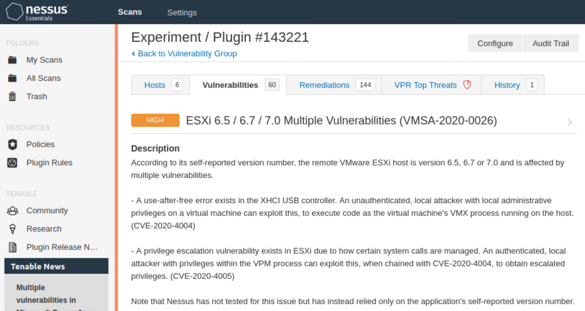

## OWASP ZAP Findings Summary

The scan identified the following critical vulnerabilities:

- Reflected XSS
- Remote Code Execution (Shellshock)
- Remote Command Injection
- CSRF tokens missing on key forms

screenshots of reults located at docs/screenshots/zap-results.png

Each of these should be prioritized for remediation based on potential exploitability and impact.

## Nessus Scan: ESXi Vulnerabilities

The following screenshot shows a Nessus scan result for an ESXi host. The scan detected multiple high-risk vulnerabilities, including:

- **CVE-2020-4004**: Use-after-free in XHCI USB controller.
- **CVE-2020-4005**: Privilege escalation in VPM process.

Screenshots of results located at: docs/screenshots/nessus-esxi.png

These findings highlight the importance of regular patching and vulnerability scanning of hypervisors in virtualized environments.

## Runtime Security Monitoring with Contrast Security
Overview
To assess the security of the WebGoat application at runtime, 
the Contrast Security Agent was deployed to monitor HTTP interactions, 
track user input, and flag potential vulnerabilities during execution. 
This method enables detection of real-time security risks that may not be caught by static analysis or conventional scanners.

- Setup
The Contrast agent was integrated with the WebGoat container environment. Once deployed, it began monitoring for:

Injection attacks

Authentication and session issues

Misconfigurations

Insecure data handling

- Visual Results
Screenshots of the Contrast Security dashboard showing these results are included:

docs/screenshots/contrast-overview.png

docs/screenshots/contrast-sql-detail.png

## WordPress Web Server Scan (Nikto)
- scan task located at Ansible/Playbooks/nikto-scan.yml
- This scan checks the WordPress instance deployed on lab_03. It uses Nikto to detect outdated software, misconfigurations, and common web vulnerabilities.

- The output is stored in an HTML file and fetched to the Ansible control node at:
  wordpress/lab_03/tmp/{{ report_name }}

Example results: [insert screenshot from report]